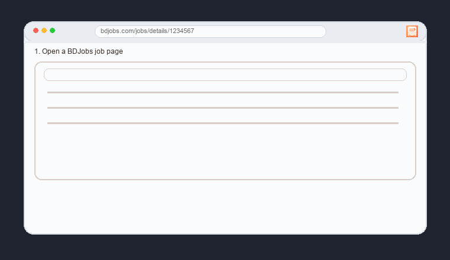

<div align="center">
  
  <h1>JobSnap</h1>
  <p>Save the JD once, stop hunting it later.</p>
  <p>
    
    
    
    
  </p>
</div>



JobSnap snapshots a BDJobs circular to your disk (raw HTML, structured JSON, and clean Markdown) the moment you apply.  
The CLI and extension share the same parser and output format.

## Requirements

- Node.js 18+ (tested with Node 22)

## Install

From source (repo):

```bash
npm install
```

NPM (global, from this repo):

```bash
npm install -g .
```

Single-file build (for sharing a one-file CLI):

```bash
npm run build:single
./dist/jobsnap.js --help
```

## Quick start (CLI)

From the repo root:

```bash
node ./cli/jobsnap.js save "https://bdjobs.com/jobs/details/1436685"
```

Or:

```bash
npm run jobsnap -- save "https://bdjobs.com/jobs/details/1436685"
```

Global install:

```bash
jobsnap save "https://bdjobs.com/jobs/details/1436685"
```

Re-parse an existing snapshot (no re-download):

```bash
node ./cli/jobsnap.js reparse jobs/1436685
```

## CLI Reference (all options)

```
jobsnap save <bdjobs_url> [--out <dir>] [--skip] [--template <pattern>] [--dry-run]
jobsnap reparse <job_dir|raw_html> [--template <pattern>] [--dry-run]
jobsnap --help (-h)
```

- `--out <dir>`: output root folder (defaults to `jobs/`)
- `--skip`: do not overwrite if the job already exists
- `--template <pattern>`: filename template, e.g. `{title}_{company}_{job_id}.md`
- `--dry-run`: preview output paths without writing files
- `--help` / `-h`: show usage + examples

## CLI Usage (what it does)

Save a circular (fetch + parse + write `raw.html`, `job.json`, `job.md`, and update `index.jsonl`):

```bash
node ./cli/jobsnap.js save "https://bdjobs.com/jobs/details/1436685"
```

Re-parse an existing snapshot (reads `raw.html`, rebuilds `job.json` + `job.md`, updates `index.jsonl`):

```bash
node ./cli/jobsnap.js reparse jobs/1436685
```

Dry run (no writes, just shows planned output paths):

```bash
node ./cli/jobsnap.js save "https://bdjobs.com/jobs/details/1436685" --dry-run
node ./cli/jobsnap.js reparse jobs/1436685 --dry-run
```

Option examples:

```bash
node ./cli/jobsnap.js save "https://bdjobs.com/jobs/details/1436685" --out ./jobs
node ./cli/jobsnap.js save "https://bdjobs.com/jobs/details/1436685" --skip
node ./cli/jobsnap.js save "https://bdjobs.com/jobs/details/1436685" --template "{title}_{company}_{job_id}.md"
node ./cli/jobsnap.js reparse jobs/1436685/raw.html --template "{title}_{company}_{job_id}.md"
```

## Help

```bash
jobsnap --help
# or
node ./cli/jobsnap.js --help
# or
npm run jobsnap -- --help
```

## Error codes

- `2`: invalid arguments / missing inputs
- `3`: invalid `jobsnap.config.json`
- `4`: fetch failed
- `5`: parse failed
- `6`: write failed

## Output (default)

```
jobs/
  index.jsonl
  <job_id>/
    raw.html
    job.json
    job.md
```

## Config

You can set defaults in a local `jobsnap.config.json`:

```json
{
  "outputDir": "jobs",
  "skip": false,
  "template": "{title}_{company}_{job_id}.md",
  "dryRun": false
}
```

Minimal example:

```json
{
  "outputDir": "jobs"
}
```

Precedence: CLI flags > `jobsnap.config.json` > `.env` > default.

You can also set an output directory in a local `.env` file:

```
OUTPUT_DIR=jobs
```

Or override per run:

```bash
node ./cli/jobsnap.js save "https://bdjobs.com/jobs/details/1436685" --out ./jobs
```

Skip if already downloaded:

```bash
node ./cli/jobsnap.js save "https://bdjobs.com/jobs/details/1436685" --skip
```

## Notes

- The CLI overwrites existing files for the same job ID (unless `--skip` is used).
- `job.md` is the primary artifact (LLM-friendly, stable headings).
- `raw.html` lets you re-parse later if the page format changes.
- `index.jsonl` is a lightweight catalog of saved jobs.

## Tests

```bash
npm test
```

## Extension

The `extension/` folder contains a MV3 extension that downloads a Markdown file
from the current BDJobs job page or a pasted URL using the same core parser.

To load it in Chrome:

1. Open `chrome://extensions`
2. Enable Developer mode
3. Click "Load unpacked" and select the `extension/` folder

If you change files in `core/`, sync them into the extension before reloading:

```bash
npm run sync-extension
```

To use:

1. Open a BDJobs job circular link.
2. Click the JobSnap extension and choose `Download from current tab`.

Or:

1. Paste a BDJobs job details link into the popup.
2. Click `Download from URL`.

Filename template:

1. Pick the filename parts (Title, Company, Job ID) in the popup.
2. JobSnap uses a fixed order: title -> company -> job id.

Defaults:

1. Open the extension options page (chrome://extensions → JobSnap → Details → Extension options).
2. The popup uses those defaults on new installs.
